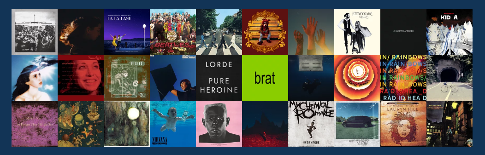

# 👋 Hi, I'm Sean!
<h3>A Computer Science & Finance Student @ University Of Waterloo! Seeking Fall 2025 SWE/ML Internships</h3>

- 🔭 I’m currently working on a **Spotify Listening Tracker**

- 🌱 I’m currently learning **Machine Learning, Data Structures and Algorithms**

- 💬 Ask me about **Front-End and Back-End Development!**

- 📫 How to reach me **seanlyw712@gmail.com**

- ⚡ Fun fact: **I pour milk in before cereal**

 

# 💻 Tech Stack:
                      

<h3 align="center">Connect with me:</h3>

## 🏆 GitHub Trophies

## ✍️ Random Dev Quote

## 💽 Album Picks

 

